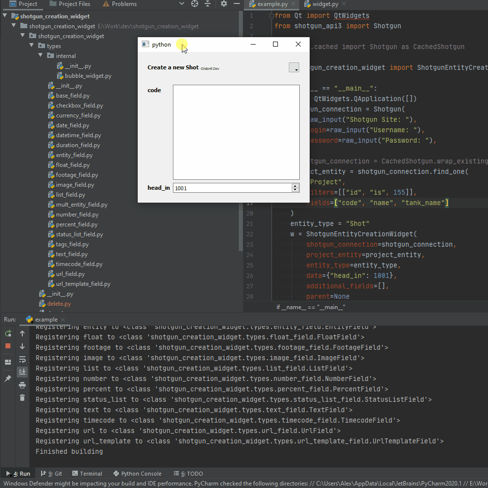

# Shotgun Creation Widget
Shotgun Creation Widget is a generic collection of widgets that will allow you to create any type of Shotgun entity.

## Developer Information
You shouldn't need much info hopefully.
A `ShotgunEntityCreateionWidget` requires the following:
  - An object that looks like a `shotgun_api3.Shotgun` instance.
  - A project entity dictionary. Ideally it has the "name" key too.
  - The type of Entity that you want to create `Shot`, `Sequence` etc.
  - [Optional] Data to prepopulate.
  - [Optional] Additional fields to show in the GUI, by default it will only show required fields.

And with that, it should ideally just work.

## Contributor Information
If you want to add an additional type of widget, either because I forgot a data type, or if you want to create a custom widget for a specific field, that functionality is available.
Using TextField as an example (`shotgun_creation_widget.types.text_field`), you can see that we need to inherit from our Qt widget type and a `WidgetBase` from `shotgun_creation_widget.base`
We allow you to define a `setup_widget` that will be called to setup settings for the widget on first create.
`_set_value` should be used to set data on the widget via code and should update the widget.
You should also make sure that widget UI changes will trigger a `value_changed` signal

## TODO

### Implement Advanced Widgets
The following end user widgets need to be implemented:
  - `entity`
  - `image`
  - `multi_entity`
  - `tags`
  - `url`
  - `url_template`

And potentially a few more.

A few of these (`multi_entity` and `tags`) will need some sort of tag/multi-entity bubbles to match Shotgun web a bit better.
I have stubbed out an `internal` subpackage that I will use for generic shared classes of Field Widgets.
Additional shared classes could be Number/Float/Percent/etc that have a lot of similar timer logic.

### Implement Actual Creation Logic
This shouldn't be hard, we just need to take the blob of data and pass it to Shotgun, potentially doing some validation.

### UI Cleanup
So it's not pretty... I know
  - It doesn't feel nice
  - We need icons for the additional fields dropdown
  - The Header could be better
  - We need a footer for "Accept" or "Do"
We should make the dropdown close when you click/unclick unless you are pressing a key (Shift? Alt?)
We also need better logic for removing widgets.
  - I think that we should change our QFormLayout to a managed QVBoxLayout with a fixed width for the left column.
    That way we could manage a Qt5 style `removeRow(<QWidget>)` ourselves.
